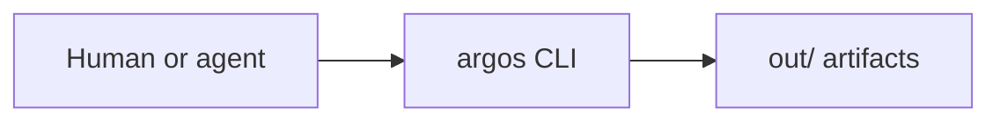
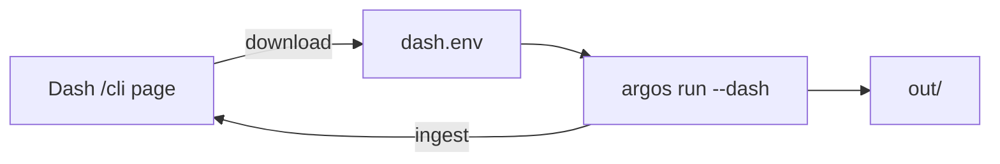

# argos

Agent-friendly **once / soak** test framework. Humans or coding agents run cases **locally**; optionally stream live status to a **self-hosted dash** instance.

| | |
|---|---|
| PyPI | `argospy` (CLI command: `argos`, import: `argos`) |
| Docs | https://lpythu.github.io/argos/ |
| Agent skill | https://lpythu.github.io/argos/skill.md |
| SDK | https://lpythu.github.io/argos/sdk.md |
| Git | https://github.com/lpythu/argos |

**Agents:** `Install https://lpythu.github.io/argos/skill.md` then drive the same CLI. Cases live in a pack repo (entry points), not in this framework repo.

## Two ways to run

### A — Local only (default)

No dash required.



```bash
pip install argospy
# install your pack (entry points under argos.packs), then:
argos list
argos run <id>
argos run <id> --env office          # e2e cases need --env
argos run <id> --soak --for 8h
```

While running, the terminal shows case banners, steps, and PASS/FAIL. When finished, open `out/<stamp>__<slug>/report.html` (also `report.md` / `report.json`). Details and examples: [Local run](https://lpythu.github.io/argos/local/).

### B — Stream to a dash instance (optional)

Dash must already be deployed. Download **`dash.env`** from that instance’s **CLI** page (`/cli`): it contains `ARGOS_DASH_URL` + `ARGOS_TOKEN`.



```bash
# after downloading dash.env from https://<your-dash>/cli
argos run <id> --dash ./dash.env

# or import into the environment
set -a && source ./dash.env && set +a
argos run <id> --dash

# one-shot URL (token still from env / secrets)
argos run <id> --dash https://dash.example.com

# upload a finished local run
argos push out/<stamp>__<slug> --dash ./dash.env
```

Put `dash.env` under `secrets/` (gitignored) or `~/.argos/`. Do not commit it. There is **no default** dash URL in the library.

## Install

```bash
pip install argospy
argos packs    # lists packs registered via entry points
```

Python ≥ 3.12. Do not use `uv run argos`.

## Write a case

Minimal example (full API: [sdk.md](https://lpythu.github.io/argos/sdk.md)):

```python
from argos.case import ONCE, Context, Spec
from argos.runner import CaseFn

def foo(ctx: Context) -> None:
    ctx.step("check", "running")
    ctx.check(True, "unreachable")
    ctx.step("check", "ok")

def cases() -> list[CaseFn]:
    return [CaseFn(Spec("foo", "short title", "live", ("e2e",), (ONCE,)), foo)]
```

New product pack: `pack.py` exporting `pack() -> Pack`, plus `[project.entry-points."argos.packs"]` in `pyproject.toml`. No `__init__.py` under case dirs.

## Docs map

| Read | Where |
|---|---|
| This README | Human / agent overview |
| Agent contract | https://lpythu.github.io/argos/skill.md |
| Terminal & `out/` | https://lpythu.github.io/argos/local/ |
| Python API | https://lpythu.github.io/argos/sdk.md |
| Connect *this* dash | `https://<dash>/cli` and `https://<dash>/skill.md` |

## Repo layout

This repository is the **framework** (`argospy`) plus **dash** source. Product cases belong in a separate pack repo. Dash is optional infrastructure you deploy; the library does not require it.
