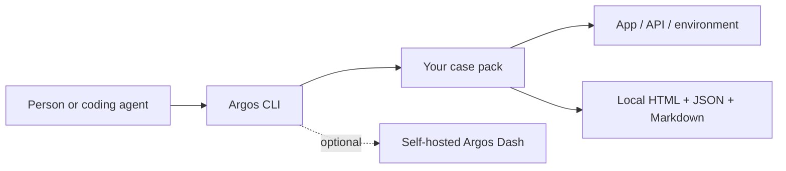

# Argos

**Repeatable checks. Evidence an agent and a human can both review.**

[](https://github.com/lpythu/argos/actions/workflows/ci.yml)
[](https://pypi.org/project/argospy/)
[](https://github.com/lpythu/argos/blob/main/LICENSE)

[Documentation](https://lpythu.github.io/argos/) · [Agent skill](https://lpythu.github.io/argos/skill.md) · [SDK](https://lpythu.github.io/argos/sdk.md) · [Runnable cases](https://github.com/benchyard/argos-pack) · [Dashboard](https://github.com/lpythu/argos-dash)

Argos is a small Python framework for **once** checks and repeated **soak** runs.
People and coding agents use the same CLI and case API. Each run produces local
HTML, JSON and Markdown reports with steps, timings, assertions and operation
records showing what was expected and what actually happened.

The package is `argospy`; the command and Python import are `argos`. Python 3.12+
is required. The framework has no runtime dependencies and no model API requirement.



## Why use it

- **Evidence beyond a green badge:** record operations, expected/actual values,
  artifacts and metrics alongside assertions.
- **One case, two schedules:** run once during development or repeatedly to observe
  stability over time.
- **Local first:** reports stay on disk; accounts and a dashboard are optional.
- **Agent-friendly:** the skill and SDK describe the same operations available to
  a human, with explicit case selectors and environment selection.

Argos complements unit-test frameworks and observability systems. It does not
prove correctness automatically, run an agent, or turn every recorded metric into
an assertion. Cases define their own acceptance criteria.

## Try a real pack

```bash
python3 -m venv .venv
. .venv/bin/activate
pip install argospy

git clone https://github.com/benchyard/argos-pack.git
pip install -e ./argos-pack
python -m http.server 8765 --bind 127.0.0.1 --directory argos-pack/examples/site
```

In another terminal with the same virtual environment active:

```bash
argos list pack:webdemo
argos run pack:webdemo --env local
argos run web:health --env local --soak --for 30s --pause 2s
```

Open the run's `report.html` from the printed output directory. See the
[example pack](https://github.com/benchyard/argos-pack) for a Skheri live-preview
check and intentionally failing test coverage. Use the installed `argos` command;
a separate transient environment may not discover your installed packs.

## Write a case

```python
from argos.case import ONCE, SOAK, Context, Spec
from argos.runner import CaseFn

def check_service(ctx: Context) -> None:
    ctx.step("health", "running")
    actual = 200  # replace with the result from your system under test
    ctx.operation("health response", kind="http",
                  operation={"method": "GET", "path": "/health"},
                  expected={"status": 200}, actual={"status": actual})
    ctx.check(actual == 200, "service must be healthy")
    ctx.step("health", "ok")

def cases() -> list[CaseFn]:
    return [CaseFn(Spec("app:health", "Service health", "api", ("e2e",),
                        (ONCE, SOAK)), check_service)]
```

Register a `Pack` via the `argos.packs` Python entry-point group. Complete runnable
registration is in [argos-pack](https://github.com/benchyard/argos-pack); API details
are in the [SDK](https://lpythu.github.io/argos/sdk.md).

For acceptance gates, explicitly assert every required condition. `ctx.threshold`
records and returns a boolean; pass it to `ctx.check` to enforce failure. A skipped
case is not proof of success, so required checks should fail when prerequisites
are missing rather than silently skip.

## Share results with your team

Deploy [Argos Dash](https://github.com/lpythu/argos-dash), sign in, and download a
connection file from its `/cli` page. Keep it outside Git:

```bash
argos run web:health --env local --dash /path/to/dash.env
argos push out/YOUR_RUN_DIRECTORY --dash /path/to/dash.env
```

The dashboard receives evidence; it does not execute your cases. There is no default
cloud service or embedded dashboard token in the library. Review report content
before sharing: arbitrary test output may contain sensitive application data.

## Product group

Use Argos independently, or combine it with [Skheri](https://github.com/benchyard/skheri)
for live-preview checks, [Acahti](https://github.com/lpythu/acahti) for commit checks,
and [Benchyard](https://github.com/benchyard/benchyard-console) for team tasks.
The [stack guide](https://github.com/benchyard/stack) describes the boundaries.

## Develop

```bash
python3 -m pip install build
python3 -m build
```

Case implementations belong in packs, not in the framework. Contributions should
keep the local runner dependency-free and preserve the documented report format.
Apache-2.0; see [LICENSE](https://github.com/lpythu/argos/blob/main/LICENSE).
