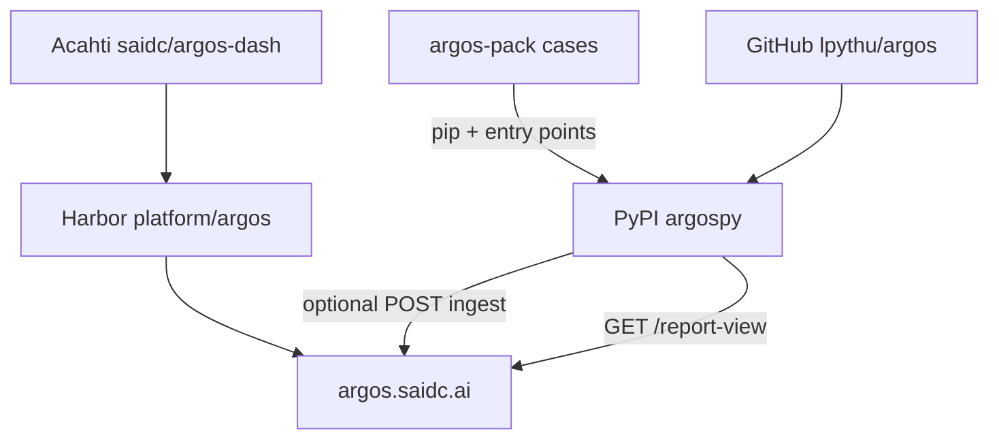
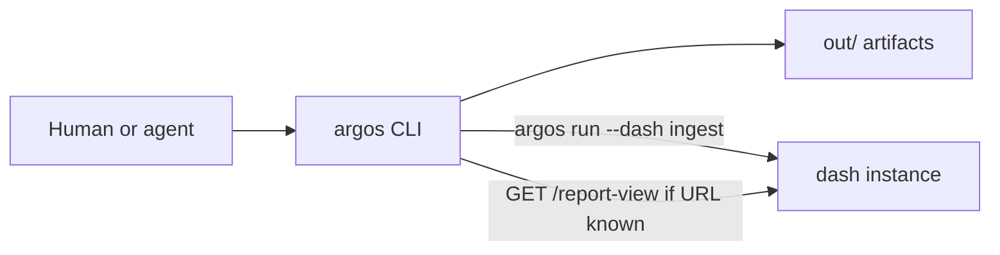
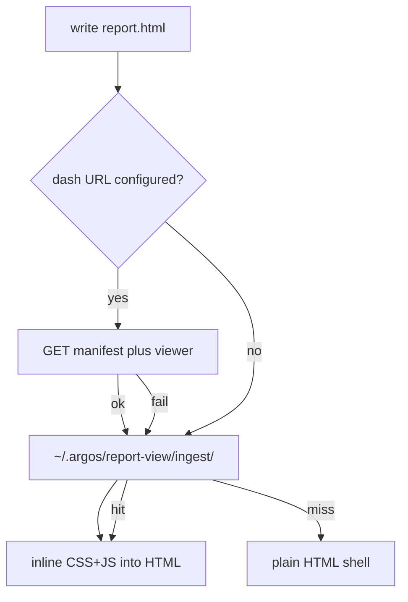
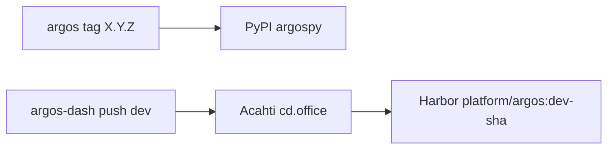

# Architecture

Argos is a **once / soak** runner. A self-hosted **dash** is optional: the CLI writes `out/` locally and can also push a run over HTTP. Styled `report.html` uses a viewer that lives in dash, not in the Python wheel.

There is no Python package dependency between the library and dash. Cases live in a third repo (`argos-pack`), not in either framework repo.

## Repos and artifacts

| Name | Host | Role |
|---|---|---|
| Git [`lpythu/argos`](https://github.com/lpythu/argos) | GitHub | CLI / SDK (`import argos`, command `argos`) |
| PyPI `argospy` | pypi.org | Install the library (`pip install argospy`) |
| Git [`saidc/argos-dash`](https://acahti.saidc.ai/saidc/argos-dash) | Acahti | Hosted run browser, ingest receiver, ReportView source |
| Image `platform/argos` | Harbor | What office Helm deploys (`argos.saidc.ai`) |
| `argos-pack` | Acahti | Product cases (`argos.packs` entry points) |

`argospy` is only the PyPI name (`argos` is the product, import, and CLI).

The library never publishes an npm package. Engineers change report styles in `argos-dash` (`ui/src/report-view`). The CLI downloads that IIFE when a dash URL is configured, caches it, and **embeds** it into `out/.../report.html`.

Hard rules:

- `argospy` does not depend on `argos-dash` as a Python package.
- Dash does not `pip install argospy`. It does not run cases.
- Report UI source lives only in dash. The wheel ships no React / viewer.js.
- Compatibility is the ingest version header (`X-Argos-Ingest` / `GET /report-view/manifest.json`), not equal semver.

## Runtime

Every run has an **actor** (who started it) and a **runner** (hostname). Pipeline jobs prefer `ACAHTI_USER`. Details: [Ingest](ingest.md).

Local-only is the default. `--dash` still writes `out/`, then POSTs the run. Download `dash.env` from that instance’s `/cli` page (`ARGOS_DASH_URL` + `ARGOS_TOKEN`). There is no default dash URL in the library.

If a dash URL is known (`--dash`, `ARGOS_DASH_URL`, or a discovered `dash.env`), the CLI also fetches the report template. Ingest still requires a token; the template GET does not.

## Local report.html

Generation always embeds. Opening an old `report.html` does not need dash to still be up. Fetch failures never fail the run. `report.json` and `report.md` are always written.

## Release

Library and dash versions are independent.

- CLI / SDK change → tag `argos` `X.Y.Z` (no `v`) → GitHub Actions → PyPI.
- Dash UI, login, Helm → `git push` `dev` on Acahti → image `dev-{sha}` + `latest`.
- Breaking ingest / `report.json` → bump `X-Argos-Ingest` and the dash manifest `ingest` field together.
