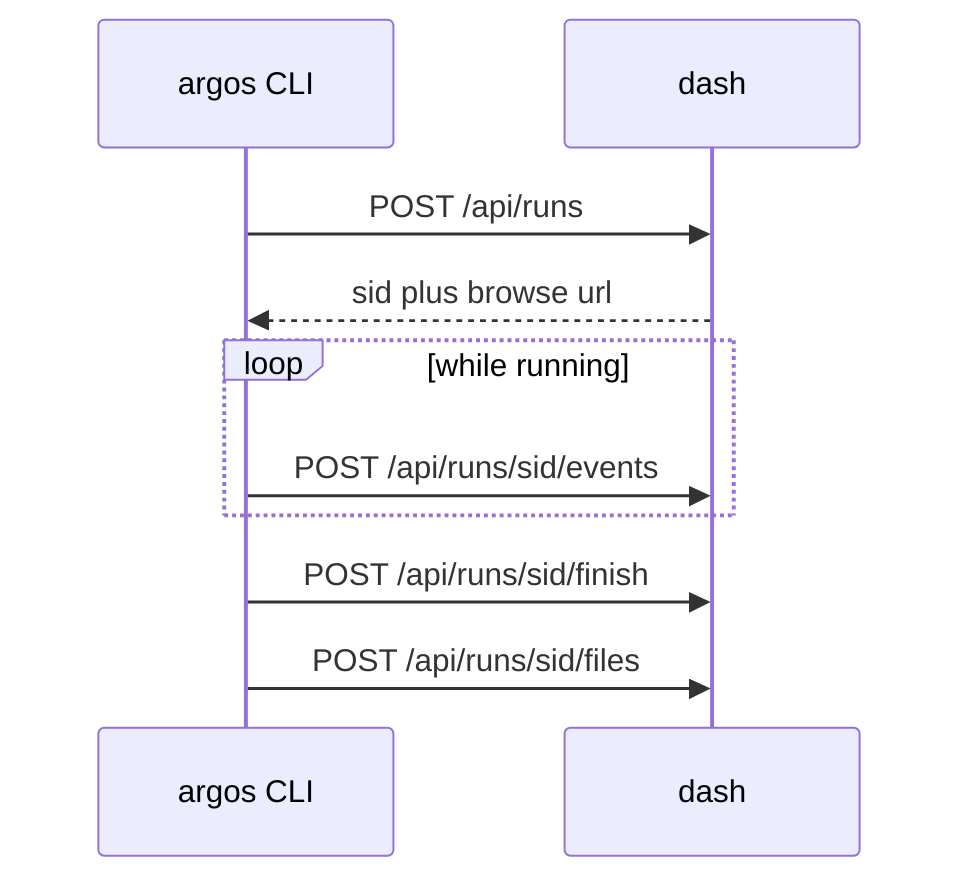
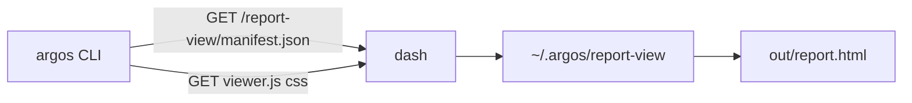

# Ingest

Ingest is the verb: the CLI **pushes** a local run to a dash instance. It is not a third repo, not a PyPI package, and not a dash process named `ingest/`.

| Piece | Where |
|---|---|
| This page | source of truth for the HTTP + JSON shape |
| Sender | `argos.client.Client` in `argospy` (`argos run --dash`) |
| Receiver | dash `POST /api/runs*` (no separate ingest service) |

Browser list APIs (`GET /api/runs` pagination) are **not** ingest. See [Architecture](architecture.md).



All four calls send `Authorization: Bearer <ARGOS_TOKEN>` and `X-Argos-Ingest: 1`. Breaking field changes increment the header and the dash `GET /report-view/manifest.json` `ingest` field together.

## Who ran it

`source.actor` is required: the **person** who started the run (login). `runner` remains the machine hostname.

| Origin | `source.kind` | `actor` |
|---|---|---|
| Acahti / Woodpecker | `acahti` | `ACAHTI_USER`, then `CI_COMMIT_AUTHOR` |
| Local CLI | `cli` | `ARGOS_ACTOR`, then `USER` / `LOGNAME`, then `getpass.getuser()` |

Do not prefer git commit author over the person who triggered or reran the pipeline.

`source` also carries pipeline provenance when `kind` is `acahti`: `repo`, `sha`, `ref`, `pipeline`, `job`, `step`, `url`, `note`.

## Endpoints

Base URL is `ARGOS_DASH_URL` with no trailing slash.

### `POST /api/runs`

Creates a run. Body includes `stamp`, `slug`, `mode`, `env`, `duration`, `queries`, `packs`, `source`, `runner`, `cases`, `status`.

Response includes `sid` (12-char public id) and `url` (`{ARGOS_DASH_URL}/runs/{sid}`). The CLI prints:

```text
argos <sid>
dash {url}
```

### `POST /api/runs/{sid}/events`

Body: `{ "events": [ ... ] }`. Each event is one public JSON object from the local `events.jsonl` line (no `result` object).

### `POST /api/runs/{sid}/finish`

Body: `{ "report": { ... }, "status": "pass" | "fail" }`. `report` is `report.json`.

### `POST /api/runs/{sid}/files`

Body: `{ "path": "relative/path", "text": "..." }`. Text files from the run dir (skip `events.jsonl`, skip binaries, skip large files).

`argos push <out-dir> --dash` replays create → events → finish → files for a finished directory.

## Not ingest

Public `GET /report-view/*` is **not** ingest. It has no Bearer token. The CLI uses it only to build local `report.html`. Shape and cache rules: [Architecture](architecture.md).


